<!-- --><!--img src="Bits&Bytes-ppt-banner-logo3.png"-->

# 
Sales Performance Review

A structured analysis of sales trends, growth rates, loyalty program ROI, and refunds/returns

<b>Period:</b> 2019 – 2022 &nbsp;|&nbsp; <b>Team:</b> Revenue Analytics &nbsp;|&nbsp; <b>Updated:</b> Apr 2023 &nbsp;|&nbsp; <b>Tools:</b> Excel/Tableau &nbsp;|&nbsp; <a href="#about-the-project">Project Overview</a>

---

## Executive Summary

<!-- **Strong momentum across all four metrics — three clear actions follow.** -->

<!--div align="left">
 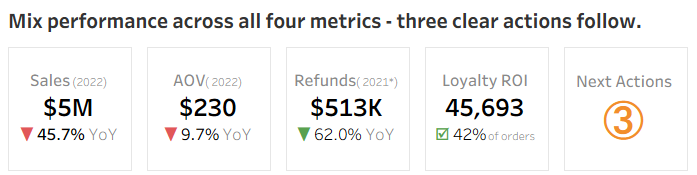  
</div-->
###  Mix performance across all four metrics - three clear actions follow.

<a href="#2022-sales-momentum-decelerated-each-quarter--full-year-revenue-hit-a-two-year-low">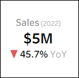</a> <a href="#1-overall-sales-trends-2019-2022">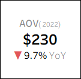</a> <a href="#4-refund-rates--average-order-value">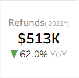</a> <a href="#3-loyalty-program-performance">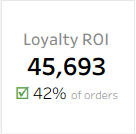</a> <a href="#5-next-steps">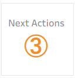</a>

  
---

## 1. Overall Sales Trends (2019-2022)

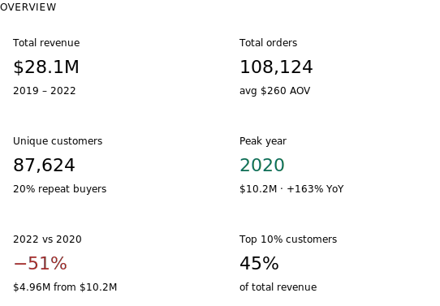

### 2022 Sales Momentum Decelerated Each Quarter — Full-Year Revenue Hit a Two-Year Low

<!-- *Visualization: Line chart · full period · annotate inflection points* -->

<table><tr><td>

 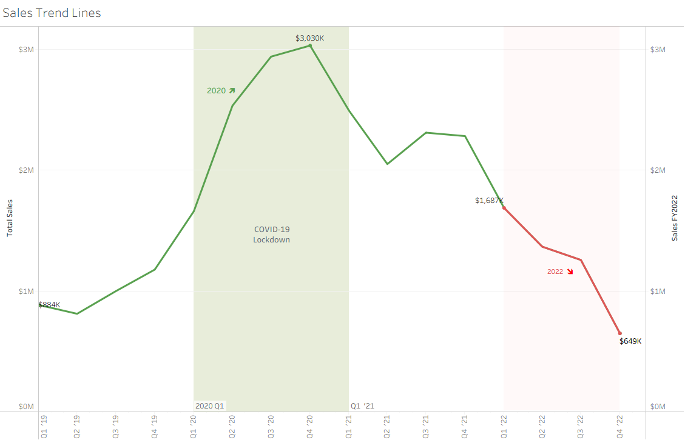 

</td></tr></table>

- **Revenue Growth and Peak Performance:** 2020 was an extraordinary outlier where revenue surged +163% to $10.2M — likely driven by pandemic-era electronics demand.
- **Declining Trend in 2021:** Every subsequent year declined, with 2022 at just $5.0M, suggesting the business hasn't found a post-boom growth path.
- **Quarterly Insights & Seasonality:** Every Q3 and Q4 end for each year showed revenue peaking — likely due holiday season shopping and marketing efforts but quickly dropped after January.
- **Overall revenue trend was in lock-step with the rest of the industry:** 
     <ul><table><tr><td align="center">
      <a href="https://static.ecommercedb.com/media/2024/05/growth-rates-of-the-global-ecommerce-market-and-the-total-retail-market-2018-2028-12929.png" target="_blank">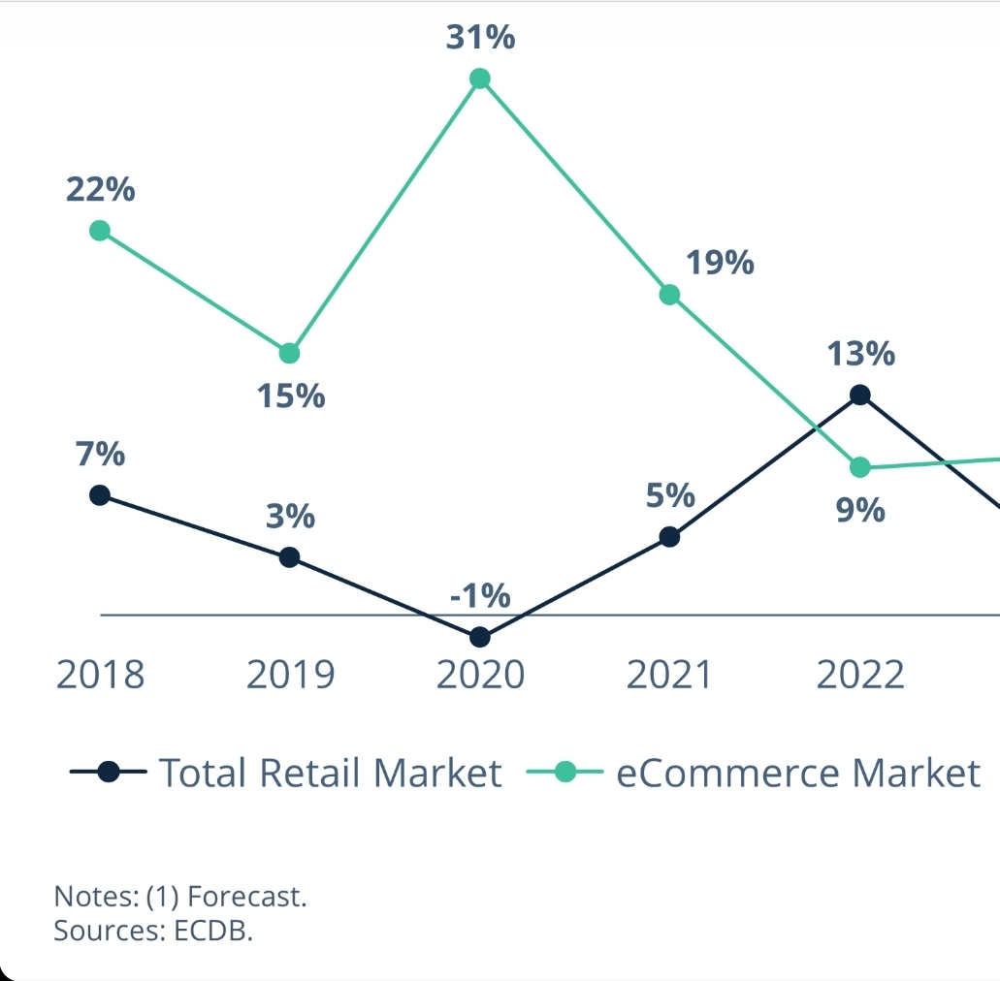</a> 
     </td></tr></table></ul>
<!--div>
    <b>Key Takeaways & Recommendations</b>
    <ul>
    <li>Overall revenue trend was in lock-step with the rest of the industry from 2019-2021:</li>
     <table><tr><td>
       
     </td></tr></table>
    <li>Investigate the causes of the 2022 decline (e.g., market changes, competition, internal factors).</li>
    <li>Leverage high-performing periods (e.g., Q3 and Q4 of strong years) to refine marketing and sales strategies.</li>
    <li>Reassess business strategy for 2023, focusing on pricing, promotions, and customer engagement to regain momentum. </li>
    </ul>  
</div-->

 

### Negative Performance Was Universal — All Four Channels Suffered Significant Sales Losses YoY(2022)
<!-- 🡻 -->
- **Direct:**  49% YoY — Direct channel dominates — dangerously at 82.6% of revenue.
- **Email:**  37% YoY — at $3.4M(12%) is the only meaningful secondary channel.
- **Social Media:**  56% YoY
- **Affiliate:**  33% YoY
- **Unknown:**  296% YoY — Need to capture correct channel for this unknown to get accurate assessment of channel performance!

<table><tr><td>

 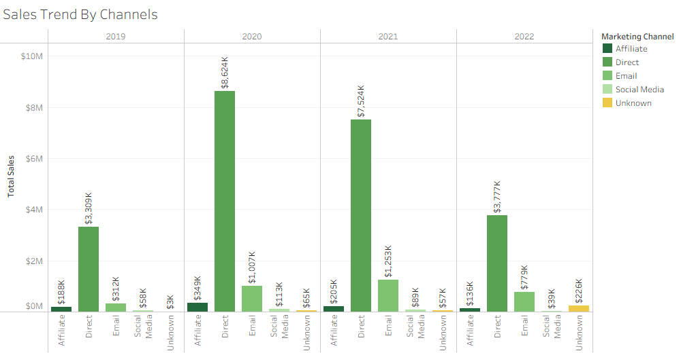

</td></tr></table>

 

### Product Performers and Disappointments
<!-- 🡻 -->
- **4K Monitor & AirPods carry the business:** These two products account for 62.6% of total revenue ($17.6M). Neither is a high-margin, high-AOV item, making volume consistency critical to sustaining overall revenue.
- **MacBook Air is the most volatile SKU:** MacBook revenue surged to $2.94M in 2020 (+384% vs 2019), then collapsed to $852K in 2022. This single SKU swing accounted for over $2M of the 2020–2022 revenue decline.

<table><tr><td>

 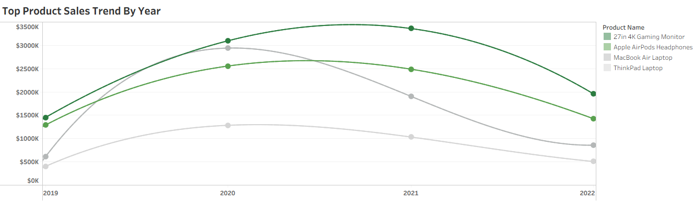

</td></tr></table>
 

---

## 2. Key Regional Insights

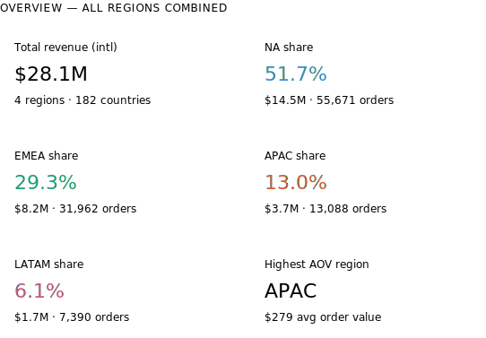

### NA Drives 51.7% Of Global Revenue, But 91.5% of That Comes From The US Alone.

<table><tr>
  <td valign="top" width="45%">
  

   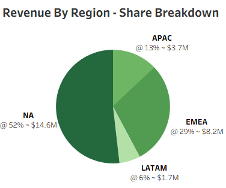 
  

  </td>   
  <td valign="top" width="55%">
  

   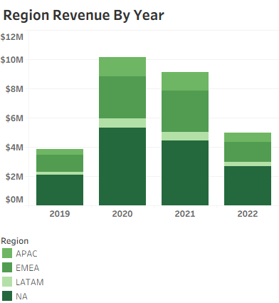
  

  </td>   
</tr></table>

---

- **Product mix is nearly identical across regions:** The 4K Monitor (~34%), AirPods (~25%), and MacBook Air (~22%) dominate revenue in every region.
- **NA had the worst refund rate in 2020 at 10%:** NA led all regions in 2020 refund rate (10.1%) vs EMEA (7.8%), APAC (9.3%), and LATAM (8.9%).
- **APAC has highest AOV, driven by JP & KR:** APAC's $279 AOV leads all regions, lifted by Japan ($393 AOV) and South Korea ($336 AOV).
- **EMEA has the broadest footprint, most diversified:** EMEA spans 99 countries with revenue spread across GB (25%), DE (12%), FR (8%), ES, NL, IT and more. No single country dominates.
- **LATAM had the sharpest decline, lowest AOV:** fell −56% in 2022 — the steepest regional drop. AOV collapsed from $293 (2020) to $169 (2022).
 

---

## 3. Loyalty Program Performance

### Loyalty Members Spend Only 14% More Per Visit — the Program Is Not Driving Real Revenue

<table>
<tr><td>

 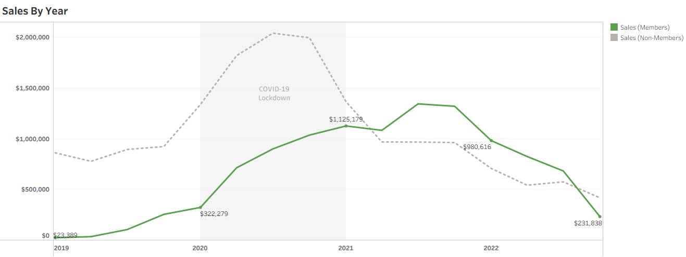 

</td></tr>
</table>

<table>
<tr><td>

 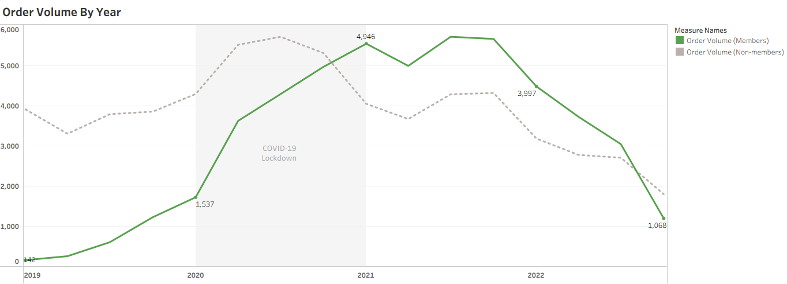 

</td></tr>
</table>

 <table>
 <tr><td>

 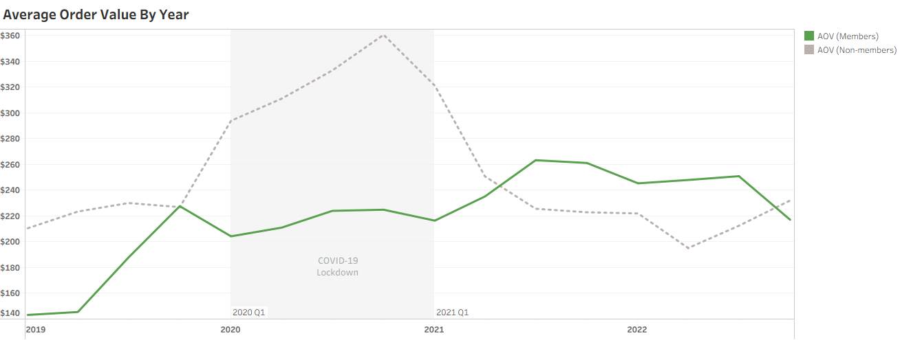 

</td></tr>
</table>

- **Members closing the AOV gap:** Members started $67 below non-members in 2019 but surpassed them in 2022 ($245 vs $214), suggesting long-term spend growth.  

 <table>
 <tr>
  <td>
  

   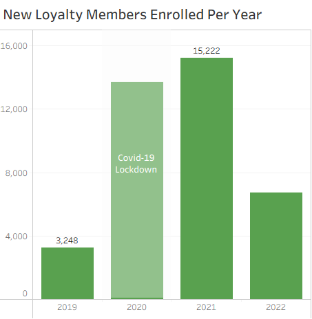 
  

</td>
 </tr>
 </table>
 
- **Membership growth peaked in 2021:** 15,222 new members enrolled in 2021 — up 5× from 2019 — before declining in 2022.   
 
 <table>
 <tr>
  <td valign="top" width="50%">
  

   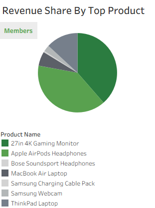 
  

  </td>  
  <td valign="top" width="50%">
  

   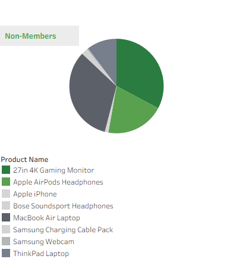 
  

</td>    
 </tr>
</table>

- **Members prefer lower-cost items:** AirPods & the 4K Monitor make up 78% of member revenue, while non-members skew toward higher-ticket MacBook purchases.
- **Email is a loyalty driver:** 24% of member orders come from email vs 12% for non-members — email marketing is twice as effective at activating members.
- **Mobile adoption is higher:** 22% of member orders come via mobile app vs 14% for non-members, indicating deeper platform engagement among members.
- **Higher refund rate warrants attention:** Members refund at 6.2% vs 4.1% for non-members. The 2020 spike (13%) is notable and may correlate with specific product or channel issues.
 

---

## 4. Refund Rates & Average Order Value

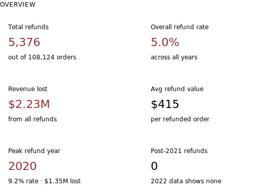

### 2020 was a crisis year - The refund rate nearly doubled to 9.2% in 2020, costing $1.35M — 60% of total refund losses. Likely driven by pandemic-era purchasing behavior and supply/quality issues

<table>
 <tr>
  <td align="center">
 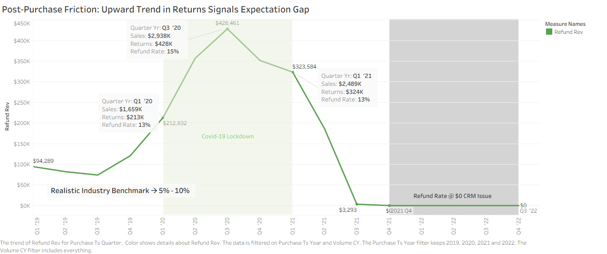
  </td>
 </tr>
</table>

- Note: Refunds Not Captured from Q4-2021 through Q4-2022 due to PSP & CRM Integration issue (  )

<table>
 <tr>
  <td align="center">
 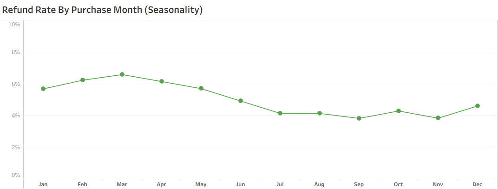
  </td>
 </tr>
</table>
- **Q1 purchases are most returned** → January–March consistently show the highest refund rates (6.2–6.6%), possibly driven by holiday gift returns or post-deal buyer's remorse

 

 <table>
 <tr>
  <td valign="top" width="50%">
  

   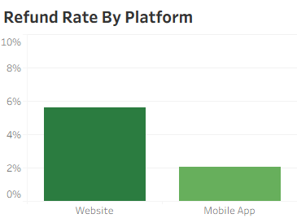 
  

  </td>  
  <td valign="top" width="50%">
  

   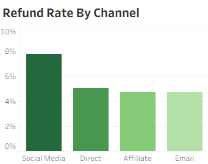 
  

</td>    
 </tr>
</table>

- **Website orders** drives most refunds as well as **Social media-acquired customers**
- 
 

### Refund Rates Peaked to a Two-Year High as Average Order Value Also Climbed to $300
*Note: Refund rate vs AOV show unusual lock-step relationship for high ticket items*
<table>
 <tr>
  <td align="center">
 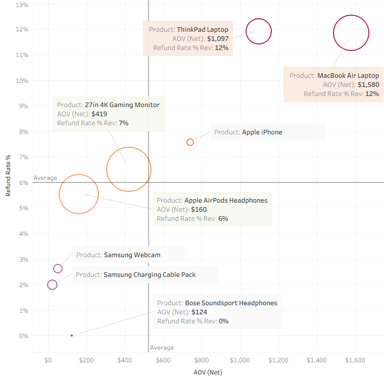
  </td>
 </tr>
</table>

- **Higher AOV Is Driven by Premium Laptop Purchases — Accounts for elevated returns as well**
- It's been reported online that the **MacBook Air shipped during 2020-2022 suffered many issues related to it's M1 Logic Board**
- **Bottom-performer** Bose products disappoints

 

 

<!--table>
 <tr>
  <td align="center">
 
  </td>
 </tr>
</table-->

---

## 5. Next Steps

### Three Priorities for Next Quarter — With Owners and Deadlines

<table>
 <tr>
  <td><b>Priority</b></td>
  <td><b>Action</b>  for Teams(<b>MK</b>-Marketing | <b>PR</b>-Product | <b>FI</b>-Finance | <b>CS</b>-Customer Service | <b>IT</b>-Support)</td>
 </tr>
 
 <tr>
  <td valign="top" align="center"><b>1</b></td>
  <td>
   <b>Goal: Keep Customers Engaged by Enhancing Loyalty Program</b>
   <ul> 
    <li><b>Enhance 3-Tiered Service Perks:</b> Move beyond simple discounts. Top-tier members should receive "money-can't-buy" services like priority technical support, extended return windows, or "white glove" setup consultations.
     <!--ol>→  <i>Tier 1: The Enthusiast (Entry Level)</i> &nbsp;&nbsp;&nbsp;&nbsp;&nbsp;•	Free to join upon first purchase or account creation &nbsp;&nbsp;&nbsp;&nbsp;&nbsp;•	1x points per $1 spent | Small Discount  | Standard Benefits</ol>
     <ol>→  <i>Tier 2: The Power User (Mid Level)</i> &nbsp;&nbsp;&nbsp;&nbsp;&nbsp;•	$1,500+ annual spend  &nbsp;&nbsp;&nbsp;&nbsp;&nbsp;•	1.5x points per $1 spent | Free "System Health Check" | Priority Support</ol>
     <ol>→  <i>Tier 3: The Elite Architect (Top Level)</i> &nbsp;&nbsp;&nbsp;&nbsp;&nbsp;•	$5,000+ annual spend &nbsp;&nbsp;&nbsp;&nbsp;&nbsp;•	2x points per $1 spent | "White Glove" | VIP Tech Support</ol-->
    </li> 
    <li><b>Reward "Technical Advocacy"(UGC):</b> Offer high-value points for detailed video reviews, setup photos, or participating in community forums. This builds trust and social proof, which are critical for expensive electronics.</li> 
    <li><b>Trade-in & Recycling Bonuses:</b> Encourage repeat business by offering loyalty members a "trade-in" point bonus when they return old electronics</li> 
    <li><a href="recommend-enhance-loyalty-program.md">Click here for more details...</a></li> 
   </ul>
  </td>
 </tr>
 
 <tr>
  <td valign="top" align="center"><b>2</b></td>
  <td>
    <b>Goal: Increase AOV ~ Increase Revenue</b>
   <ul> 
    <li><b>Diagnose and address the 2021–2022 revenue decline urgently</b></li>
     <ol>•	<b>Determine how much is post-pandemic normalization vs lost market share vs product mix issues:</b> Set a 2023 baseline target with a clear growth plan rather than drifting further below peak.</ol>
     <ol>•	<b>Reduce product concentration risk — diversify beyond 4K Monitor & AirPods:</b> 62% of revenue from two products is a structural risk. Expand the product catalog in adjacent categories (monitors, audio, accessories) or introduce bundling to increase basket size and reduce single-SKU dependence.</ol>
     <ol>•	<b>Build a repeat purchase program — LTV is the highest-leverage metric:</b> With 80% of customers buying only once, even a 10% improvement in repeat rate would add ~$2.8M in incremental revenue. Launch post-purchase email sequences, loyalty rewards, and product upgrade paths (e.g., cable → webcam → monitor).</ol>
     <ol>•	<b>Invest in paid and email acquisition to reduce direct-channel dependency:</b> Direct traffic at 82.6% leaves the business vulnerable to any organic drop-off. Email already converts well ($180 AOV, 12% of revenue) — scale it. Test paid social and affiliate programs on mid-range products to develop acquisition redundancy.</ol>
     <ol>•	<b>Capitalize on Q1 volume and seasonal patterns:</b> January is the single strongest revenue month. Lean into this with post-holiday promotions, new-year upgrade campaigns, and inventory preparation. September and December are also strong — build campaigns around these rather than spreading budget evenly.</ol> 
    <li><b>Region Enhancements</b></li>
     <ol>•	<b>Launch mobile-first campaigns in LATAM immediately:</b>  LATAM's 25.7% mobile app order share is the highest globally, yet the region contributes just 6% of revenue. Mobile-optimized ads (Instagram, TikTok), app-exclusive promotions, and local payment methods (Pix in Brazil, OXXO in Mexico) could unlock significant volume from an undermonetized mobile base.</ol>
     <ol>•	<b>Aggressively expand EMEA — it's the most scalable region:</b>  EMEA has 99 active markets, the widest geographic spread, and strong AOV ($258).</ol>
     <ol>•	<b>Develop JP and KR as premium APAC growth anchors:</b>  Japan ($393 AOV) and South Korea ($336 AOV) are clear premium markets buying high-ticket items. Building dedicated product pages, loyalty tiers, and local-language support for these two markets could meaningfully grow APAC's 13% revenue share without broad market expansion costs.</ol> 
    <li>High-Impact Bundling & Configuration</li>
     <!--ol>•	"Complete My Build" Bundles &nbsp;&nbsp;&nbsp;&nbsp;&nbsp;→  Automatically suggest essential items that a customer might forget.</ol>
     <ol>•	Tiered Performance Kits &nbsp;&nbsp;&nbsp;&nbsp;&nbsp;→  Instead of selling a single PC, offer "Starter," "Pro," and "Ultra" bundles packages.</ol>
     <ol>•	Software & Content Add-ons &nbsp;&nbsp;&nbsp;&nbsp;&nbsp;→  Bundle high-end GPUs with trending game codes or creative software suites (e.g., Adobe Creative Cloud for workstations).</ol--> 
    <li>Strategic Upselling & Thresholds</li>
     <!--ol>•	Free Shipping Thresholds &nbsp;&nbsp;&nbsp;&nbsp;&nbsp;→  Set free shipping limit approximately 30% above your current AOV. &nbsp;&nbsp;&nbsp;&nbsp;&nbsp;→ Offering free expedited shipping on orders over $2,000.</ol>
     <ol>•	Comparison-Based Upselling &nbsp;&nbsp;&nbsp;&nbsp;&nbsp;→  Side-by-side tables comparing a base model to a "Premium" version on product pages.</ol>
     <ol>•	Shipping Protection" Add-ons &nbsp;&nbsp;&nbsp;&nbsp;&nbsp;→  Offer a low-cost, high-margin "Premium Shipping Protection" or "No-Hassle Return" fee at checkout.</ol--> 
    <li>Post-Purchase & Checkout Optimization</li>
     <!--ol>•	One-Click Post-Purchase Upsell &nbsp;&nbsp;&nbsp;&nbsp;&nbsp;→  Immediately after purchase, offer a "15-minute only" discount on extended warranties or a premium monitor arm.</ol>
     <ol>•	Flexible Payment Options (BNPL) &nbsp;&nbsp;&nbsp;&nbsp;&nbsp;→  Integrating services like Affirm or Shop Pay Installments can increase AOV by up to 79% for high-ticket items, as it makes expensive workstation builds feel more accessible through monthly payments.</ol>
     <ol>•	"Pro Tips" in Cart &nbsp;&nbsp;&nbsp;&nbsp;&nbsp;→  Add educational messaging like "Pro Tip: This laptop requires...".</ol--> 
    <li>Gift Cards</li> 
    <li>Free Gifts</li> 
    <li><a href="recommend-increase-aov.md">Click here for more details...</a></li> 
    </ul>     
  </td>
 </tr>
 
 <tr>
  <td valign="top" align="center"><b>3</b></td>
  <td>
   <b>Goal: Lower Return/Refund Rates (Between 5% to 10%; currently @ 12%)</b>
   <ul> 
    <li>Proactive Technical Support &amp; Onboarding</li>
     <!--ol>→  Post-Purchase Drip Campaigns &nbsp;&nbsp;&nbsp;&nbsp;&nbsp;•	Send automated emails with setup guides, video tutorials, and common "first-day" troubleshooting tips.</ol>
     <ol>→  Live Pre-Purchase Assistance &nbsp;&nbsp;&nbsp;&nbsp;&nbsp;•	Use live chat to answer compatibility questions before the order is placed to prevent incorrect purchases.</ol>
     <ol>→  "Check for Incompatibility" Alerts &nbsp;&nbsp;&nbsp;&nbsp;&nbsp;•	Add subtle cart notifications if a customer adds a frequently returned item or one with known compatibility requirements.</ol--> 
    <li>Enhanced Product Accuracy</li>
     <!--ol>→  Detailed Technical Visuals &nbsp;&nbsp;&nbsp;&nbsp;&nbsp;•	Move beyond white-background photos to include 360-degree views, 3D visualizations, and videos that demonstrate the product's interface and functionality.</ol>
     <ol>→  Comparison-Based Upselling &nbsp;&nbsp;&nbsp;&nbsp;&nbsp;•	Use lifestyle imagery showing a person using the device to prevent returns due to an item being larger or smaller than expected.</ol>
     <ol>→  Detailed Specifications &nbsp;&nbsp;&nbsp;&nbsp;&nbsp;•	Clearly list all materials, exact dimensions, and system requirements to set accurate expectations before checkout.</ol--> 
    <li>Strategic Shipping & Return Policies</li>
     <!--ol>→  Rigorous Packaging Protocols &nbsp;&nbsp;&nbsp;&nbsp;&nbsp;•	Use protective inserts like custom foam or double-boxing for fragile high-end components.</ol>
     <ol>→  Incentivized Exchanges &nbsp;&nbsp;&nbsp;&nbsp;&nbsp;•	Offer immediate replacements or a bonus (e.g., 10% extra store credit) if a customer chooses an exchange over a full refund.</ol>
     <ol>→  Restocking Fees &nbsp;&nbsp;&nbsp;&nbsp;&nbsp;•	For high-cost items, implement a reasonable restocking fee for "change of mind" returns to discourage casual or habitual returning.</ol--> 
    <li><a href="recommend-return-refund-rate.md">Click here for more details...</a></li> 
   </ul>   
  </td>
 </tr>
</table>

 
<b>Notes: Operations</b>
   <ul> 
    <li>IT &amp; Marketing: Workshop to better capture channel correctly instead of "Unknown"</li>
    <li>RCA to recover Q2 FY2022 lost/missing refunds(CRM integration issue)</li>
    </ul>     

---

 

*Bits&Bytes Commerce Inc. · Revenue Analytics · Confidential &nbsp;|&nbsp; `sales-performance-review · v1.2.0`*

 

---

## About The Project 

### Company 
**Bits&Bytes Commerce Inc.(B&B)** is a privately held eCommerce company based in Houston Texas that sells top-brand consumer electronics and accessories like Apple, Samsung, and ThinkPad to a global clientele. The company has successfuly pivoted, grown and expanded since it's launch in 2018 from being a B2B reseller to a Direct-to-Consumer retailer. At the beginning of 2020, it has encountered increasing competition within the industry as well as unique challenges and opportunities brought on by the COVID-19 pandemic.

### The Ask 
In coordination with the Head of Operations, an in-depth analysis was conducted to evaluate **B&B’s** performance over the period of 2019–2022. This comprehensive review provides valuable insights that Angie Lopez (Head of Operations) and the various internal cross-functional teams will utilize to streamline processes and enhance **B&B’s** commercial performance for FY23 and beyond. The key insights and recommendations focus on the following areas:
 
#### Northstar Metrics
* **Sales trends** - Focusing on key metrics of sales revenue, number of orders placed, and average order value (AOV).
* **Product performance** - Analyzing different product lines, market impact, and refund rates to inform strategic product decisions.
* **Loyalty program evaluation** - Evaluating the effectiveness of the company's loyalty program and providing recommendations to maximize customer engagement and retention.
* **Regional results** - Evaluating regional demand and product performance within regions to identify areas for improvement.

### Assumptions  
* **Backdated Analysis** - This analysis reporting assumes that the present year is 2023 and the data for review is from the prior 4 years of 2019-2022.
* **Rough Data** - The dataset is assumed to have been pulled together from older system app sources which explains the "not so clean" state.
* **Missing Returns/Refund Data** - The hypothetical cause for the missing returns data for the period Q1-Q3 2023 was due to a major systems issue that resulted in the non-capture of returns transactions.

### Operational Data 
**B&B’s** current book of business encompasses nearly **88,000 customers** and more than **108,000 transactions**, yielding a total sales revenue exceeding **$28M USD**. The accompanying eCommerce dataset provides comprehensive data across multiple dimensions, including product performance, regional sales distribution, and loyalty program engagement.  

 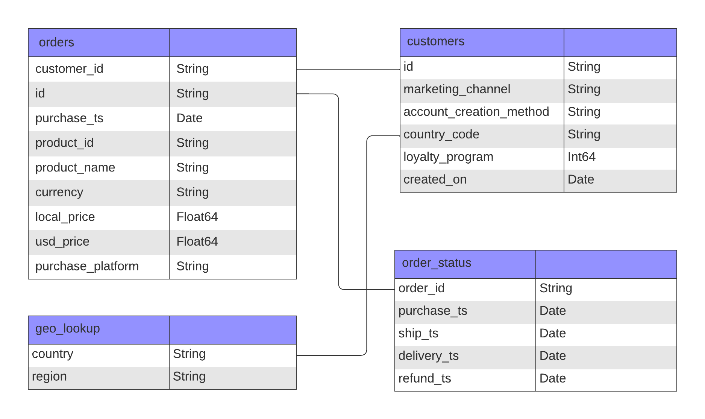 
 B&B Entity Relationship Diagram (ERD)

 

**Note:**  The raw data was extracted from an older payment platform (prior to Shopify adoption 2021) that resulted in a "*not so clean*" dataset. See [EDA process](/doc/BB_EDA.pdf) on how the dataset was cleaned and prepared for this analysis.

 
 

[Back to Sales Performance Review](#sales-performance-review)

 

---

  

